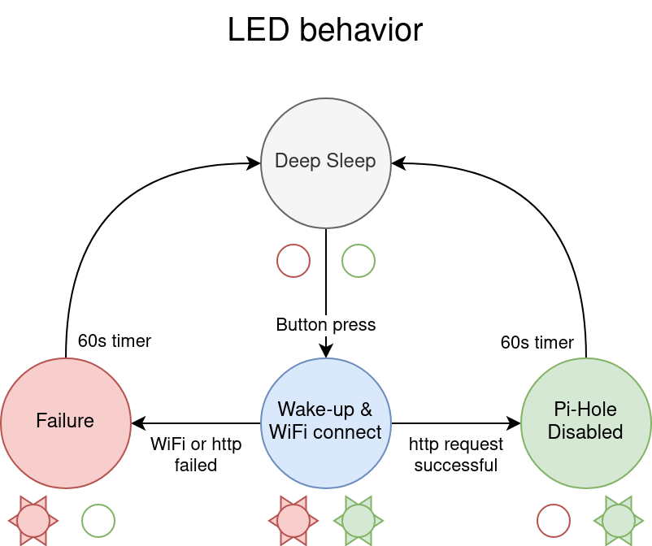

ESP32 Pi-Hole disable button
====================

The objective is to make a physical button which will disable the Pi-Hole add blocker for one minute.

# How to compile
This project uses the wonderful esp-idf SDK from Espressif. You will need to install it in order to compile this project.
1. Enter the required secrets with `idf.py menuconfig`
2. Build, flash, and monitor with `idf.py flash monitor`

# LED indicators

# Secrets
This repo does not track the WiFi SSID, password, or the pi-hole API token. You will have to run `idf.py menuconfig` and enter these secrets manually in the "WiFi and Pi-Hole credentials" sub-menu

# Links
* [ESP-IDF Programming Guide](https://docs.espressif.com/projects/esp-idf/en/stable/esp32/index.html)
* [ESP32 Datasheet](http://espressif.com/sites/default/files/documentation/esp32_datasheet_en.pdf)
* [ESP32 Technical Reference Manual](https://espressif.com/documentation/esp32_technical_reference_manual_en.pdf)
* [ESP32-WROOM-32 Datasheet](https://www.espressif.com/sites/default/files/documentation/esp32-wroom-32_datasheet_en.pdf)
* [Pi-Hole API](https://discourse.pi-hole.net/t/pi-hole-api/1863)
